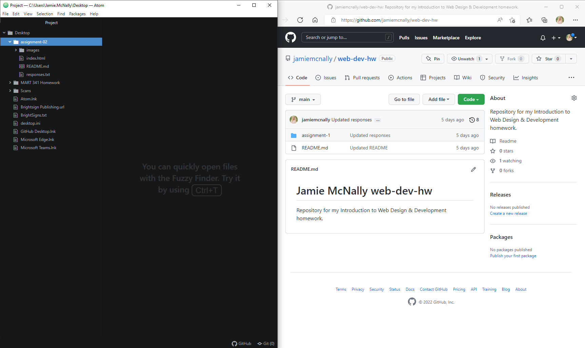

  # Exercise-02
  ## Jamie McNally

  I am a paragraph!

  A list of things in markdown:

  - item 1
  - item 2
  - item 3

  1. item 1
  2. item 2
  3. item 3

[Google Search](https://www.google.com/)

[My Responses File](./responses.txt)

